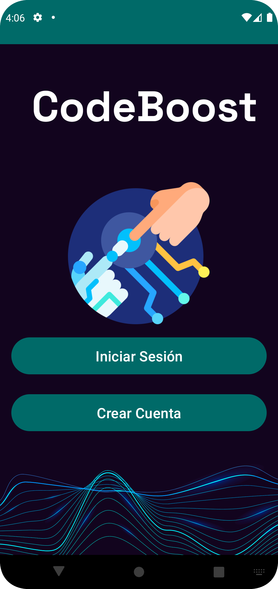
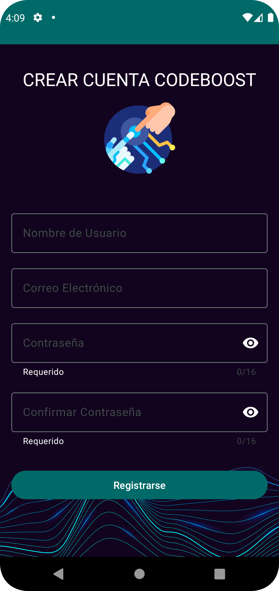
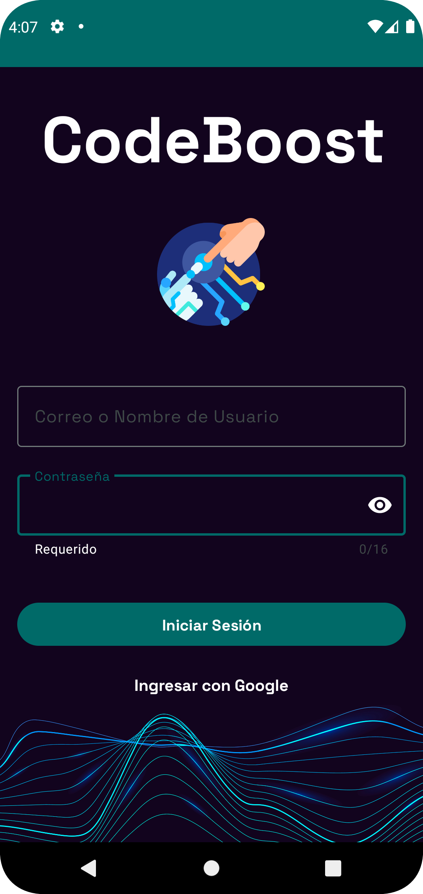
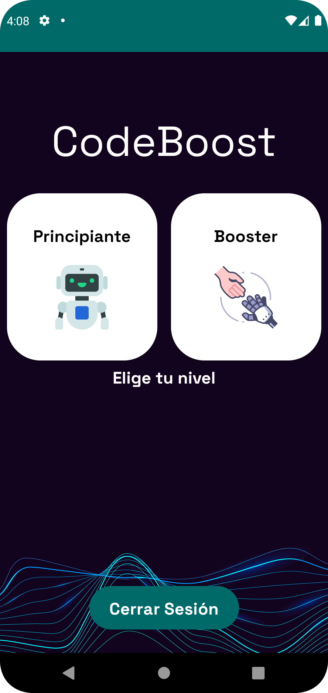
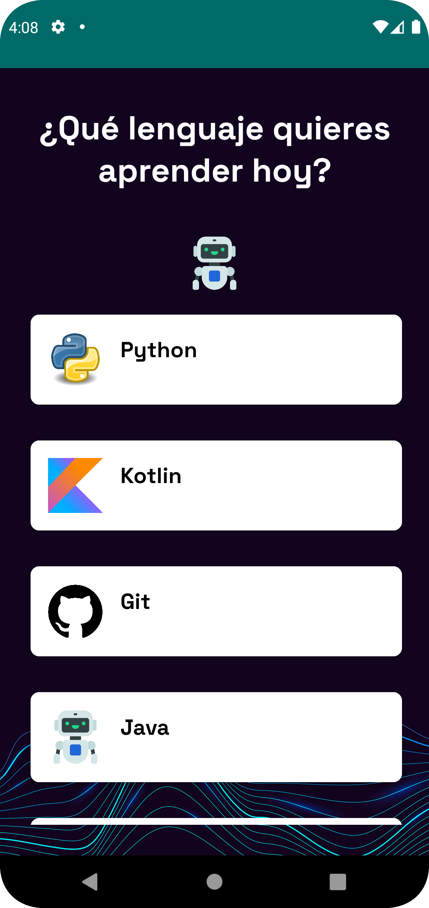
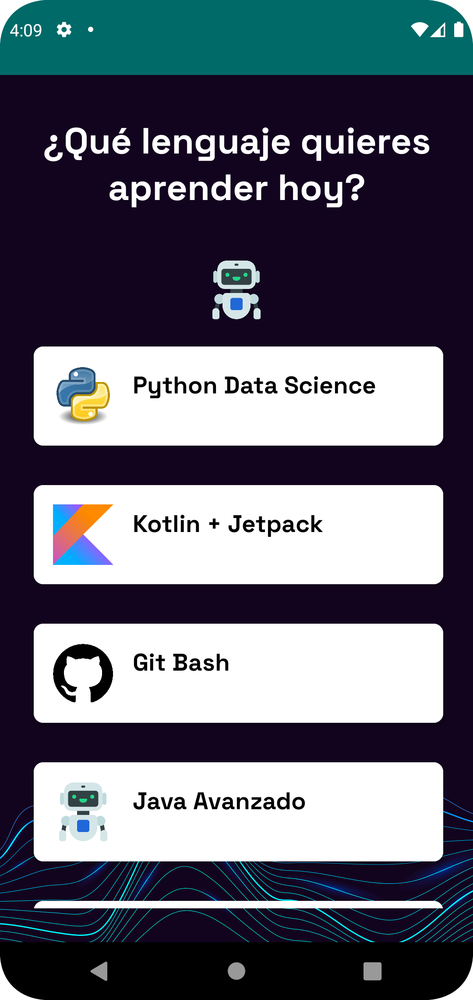
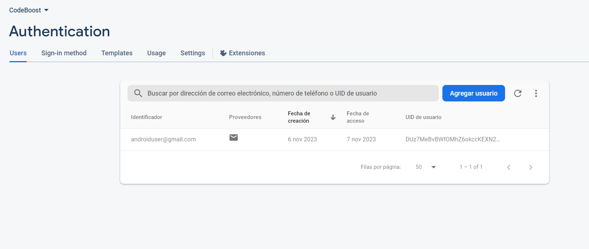
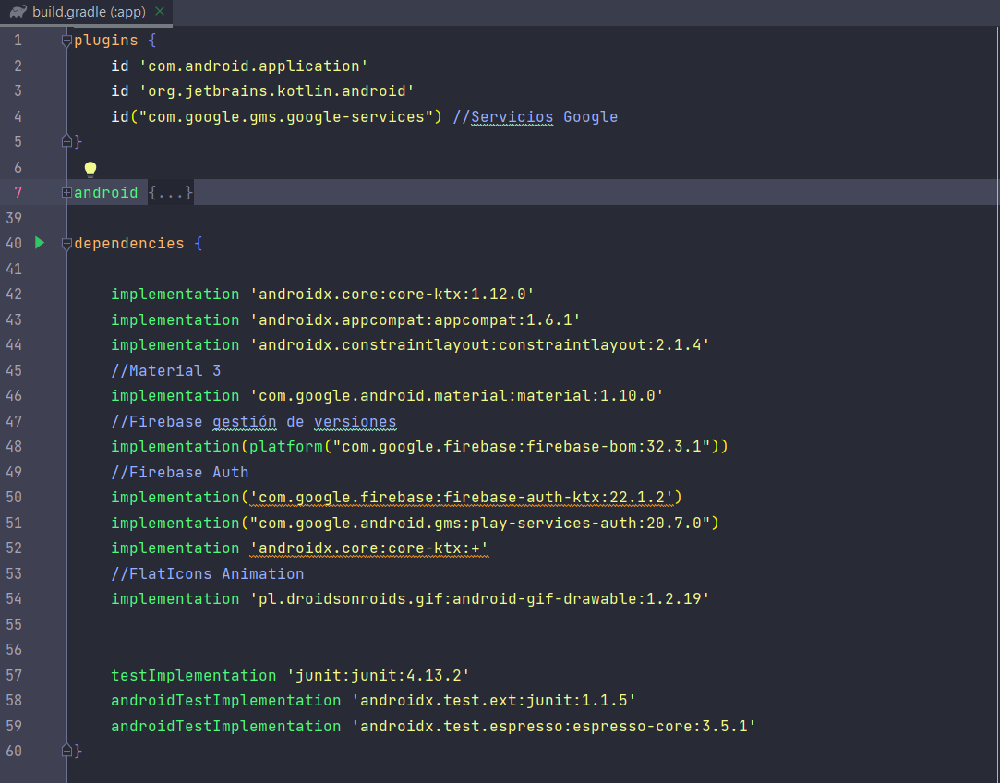
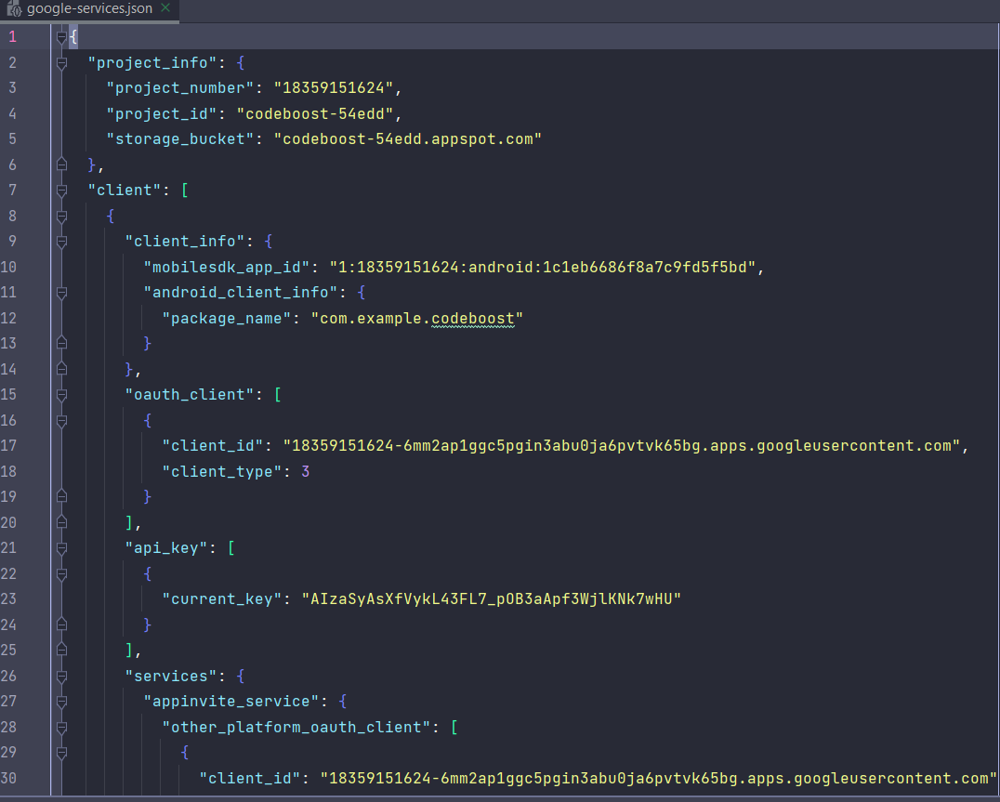

# CodeBoost

**CodeBoost** es una aplicación de Android desarrollada en Kotlin con el objetivo de proporcionar un aprendizaje básico para algunos lenguajes de programación populares. La aplicación utiliza Material Design 3 y Firebase para ofrecer una experiencia de usuario moderna y almacenamiento de datos en la nube.

## Features

- **Lenguajes de Programación**: Aprende lo básico de populares lenguajes de programación como: Python, Java, Kotlin, JavaScript.

- **Ejemplos de Código y Quizz**: Explora ejemplos de código y completa ejercicios prácticos para reforzar tu conocimiento.

- **Progress Tracking**: Regístrate y realiza un seguimiento de tu progreso a medida que avanzas en tu viaje de aprendizaje.

- **Recursos Adicionales**: Acceso a recursos extra, como links a tutoriales y documentación, para más información sobre cada lenguaje.

## Requisitos de Desarrollo

- Android Studio 4.0 o superior
- Kotlin 1.5 o superior
- Firebase Project (para almacenamiento en la nube)

## build.gradle(Module.app)
`plugins`
- `id("com.google.gms.google-services")`

## build.gradle(Project)
`dependencies`
- `classpath 'com.google.gms:google-services:4.4.0`
  
## Dependencias
- `implementation 'androidx.core:core-ktx:1.12.0'`
- `implementation 'androidx.core:core-splashscreen:1.0.1'`
- `implementation 'com.google.android.material:material:1.10.0'`
- `implementation(platform("com.google.firebase:firebase-bom:32.3.1"))`
- `implementation('com.google.firebase:firebase-auth-ktx:22.1.2')`
- `implementation("com.google.android.gms:play-services-auth:20.7.0")`

## Requisitos Mínimos para Ejecutar la Aplicación

Para ejecutar la aplicación en un dispositivo o emulador, necesitas:

- API 24: Android 7.0 (Nougat) o superior

## Vistas

<table>
  <tr> 
    <td></td>
    <td></td>
    <td></td>
  </tr>
  <tr>
    <td></td>
     <td></td>
    <td></td>
  </tr>
  <tr>
    <td></td>
    <td></td>
     <td></td>
  </tr>
</table>
